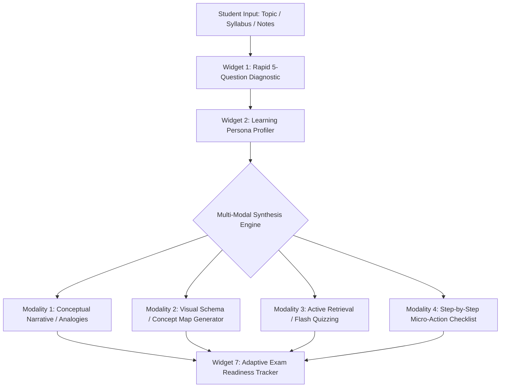

# Agentic Learning Architecture: Diagnostic Assessment & Multi-Modal Teaching Engine

> **Scenario Alignment**: Scenario 2 (*Study Buddy: The AI Learning Sidekick*)  
> **Target Tool**: Amazon Quick (Apps Mode) / Fallback: PartyRock (`partyrock.aws`)  
> **Core Innovation**: Moving beyond generic chat into an **adaptive diagnostic system** that matches learning modalities to the student's cognitive profile in under 60 seconds.

---

## 1. System Architecture & Flow



---

## 2. The 5-Question Diagnostic (Frictionless & Fast)

Instead of a long, boring psychometric test, use 5 punchy, scenario-based multiple-choice questions (or single inputs) that students can answer in 30 seconds:

| Q# | Prompt / Scenario | Diagnostic Signal (VARK + Cognitive Style) |
|:---|:---|:---|
| **Q1** | *"When a professor introduces a brutal new formula or theory, what do you reach for first?"* | **A)** Diagram / Graph (Visual)<br>**B)** Real-world analogy (Verbal / Conceptual)<br>**C)** Code or practice problem (Kinesthetic) |
| **Q2** | *"What causes you to zone out first during a 75-minute lecture?"* | Identifies **cognitive friction points** (monotone delivery, dense walls of text, abstract math). |
| **Q3** | *"When you review 48 hours before an exam, what works best?"* | **A)** Flashcards / Active recall<br>**B)** Teaching it to a friend<br>**C)** Redrawing notes / cheat sheet |
| **Q4** | *"What is your current stress / urgency level for this topic?"* | **A)** Casual curiosity<br>**B)** Midterm in 3 days<br>**C)** Exam tomorrow morning (Cram mode) |
| **Q5** | *"Pick your preferred AI tutor vibe:"* | **A)** Supportive mentor<br>**B)** No-nonsense Socratic professor<br>**C)** Peer study buddy (Gen-Z collegiate) |

---

## 3. The 4 Robust Modalities (Feasibility & Error Prevention)

Can we do 3–4 modalities easily without errors in Amazon Quick or PartyRock? **Yes**, provided each modality has a bounded, deterministic prompt contract:

### Modality 1: The Intuitive Analogist (Verbal / Metaphorical)
* **Goal**: Break down high-level abstraction into relatable physical models.
* **Error Prevention**: Explicitly bound length to 150 words max. Mandate: *"Explain this using a dorm, dining hall, or smartphone analogy."*

### Modality 2: The Visual Blueprint (Visual / Schematic)
* **Goal**: Visual reinforcement.
* **How to implement reliably**:
  * **Option A (Instant text-based visual)**: Output a clean **Mermaid diagram**, **ASCII flow diagram**, or structured visual breakdown table.
  * **Option B (AI Image Generation widget)**: Pass an image prompt directly to Amazon Titan Image Generator:  
    *Prompt template*: `"Educational infographic-style digital diagram explaining [Topic], vibrant high-contrast colors, labeled clean visual elements, clean modern graphic design."*

### Modality 3: The Socratic Sparring Partner (Kinesthetic / Active Recall)
* **Goal**: Interactive retrieval practice.
* **Error Prevention**: Rather than dumping 20 questions, generate **3 progressive micro-challenges**:
  1. *Warm-up*: Identify the false premise.
  2. *Application*: Fix a broken scenario.
  3. *Synthesis*: Explain it back in one sentence.

### Modality 4: The 15-Minute Action Sprint (Executive Function / ADHD-Friendly)
* **Goal**: Eliminate study paralysis.
* **Error Prevention**: Convert the topic into a concrete 3-step timeline:
  - *Minutes 0–5*: Passive scan & key terms.
  - *Minutes 5–12*: Active recall problem.
  - *Minutes 12–15*: Self-audit check.

---

## 4. Amazon Quick / PartyRock Implementation Blueprint

### Seed Prompt for "Apps" Mode
Copy and paste this structured prompt into the Amazon Quick App Generator:

```text
Build a web application called "NeuroSprint: The Adaptive Learning Sidekick" designed for college students.

The app consists of the following connected widgets:
1. User Input Widget ("Study Topic & Material"): Allows the student to paste lecture notes, concepts, or syllabus text.
2. Form / Multiple Choice Widget ("5-Second Learning Diagnostic"): 5 quick questions gauging preferred learning format (Visual, Analogy, Active Practice, Cram Sprint) and tutor personality.
3. Text Generation Widget ("Persona & Strategy Analyzer"): Synthesizes the topic and survey into an individualized learning profile and game plan.
4. Text Generation Widget ("Modality 1: Analogy & Concept Breakdown"): Explains the core concept strictly using relatable, plain-English dorm/college life analogies.
5. Text Generation Widget ("Modality 2: Visual Map & Schematics"): Generates a structured ASCII flowchart or Mermaid diagram mapping how the concept's components link together.
6. Interactive Chat Widget ("Modality 3: Socratic Practice Sparring"): Tests the student with bite-sized quiz questions, giving immediate friendly feedback.
7. Image Generation Widget ("Modality 4: Memory Anchor Visual"): Generates a clean, aesthetic visual diagram or motivational infographic summarizing the concept.

Ensure the user experience is clean, modern, encouraging, and free of dry academic jargon.
```

---

## 5. Why This Wins the Shark Tank Pitch (2-Minute Angle)

* **The Problem Hook (20s)**: *"Every student learns differently, but 300-person lecture halls teach everyone the exact same way. Most students don't fail because they're not smart; they fail because the format doesn't fit their brain."*
* **The Solution (40s)**: *"NeuroSprint turns any intimidating topic into a personalized learning pathway in 30 seconds. With 5 rapid questions, it maps your cognitive profile and serves the material in your ideal modality—analogies, visual blueprints, Socratic sparring, or a 15-minute action sprint."*
* **The Demo/Result (40s)**: *"Watch it take a complex algorithm: visual learners get a flowchart, intuitive learners get a dining hall analogy, and crammers get an interactive quiz."*
* **The Vision (20s)**: *"Personalized private tutoring costs $80/hour. NeuroSprint makes world-class adaptive education accessible to every student on campus."*
